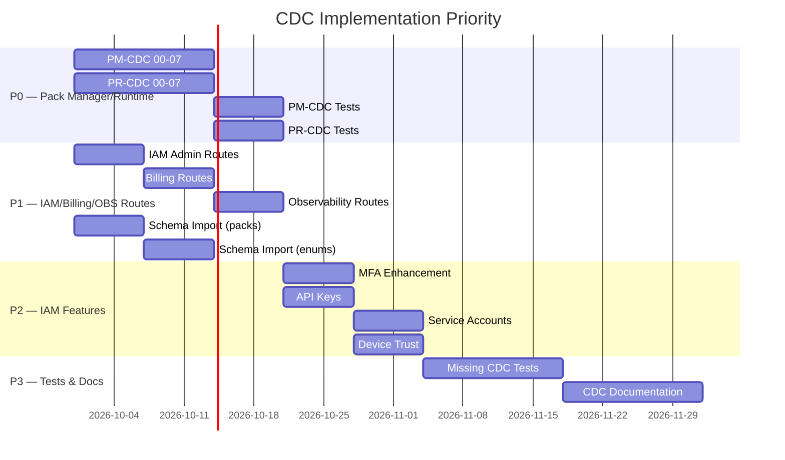

# Report 14: CDC Compliance Matrix

**Scope:** Cross-reference all CDCs across all repositories and modules
**Date:** 2026-09-29

---

## 14.1 Executive Summary

This report provides a master matrix of all CDC compliance across:

| Repository/Branch | CDCs Covered |
|-------------------|-------------|
| Local (`main`) | BM-CDC, PM-CDC, PR-CDC, PF-CDC, INT-CDC, DEP-CDC, ERP-CDC, DT-CDC, WF-CDC, IAM-CDC, BIL-CDC, OBS-CDC |
| jasmina-bm/Mami | BM-CDC (08 only), PM-CDC (07), PR-CDC (07) |
| jasmina/develop | PF-CDC (06), INT-CDC (09), DEP-CDC (09) |
| taratra31/main | IAM-CDC (13), BIL-CDC (03), OBS-CDC (03) |
| taratra31/ERP-full | ERP-CDC, DT-CDC, WF-CDC, IAM-CDC (partial) |
| taratra31/Lianah | UI/UX (no CDCs) |

---

## 14.2 Business Manager CDCs (BM-CDC-00 through BM-CDC-16)

| CDC | Requirement | Local | jasmina-bm/Mami | taratra31 | Status | Priority |
|-----|-------------|-------|-----------------|-----------|--------|----------|
| BM-CDC-00 | BM Module Foundation | `business-manager.module.ts` (Prisma) | Same (TypeORM) | N/A | CURRENT_MORE_COMPLETE | P1 |
| BM-CDC-01 | Data Model Definition | `data-model.service.ts` | Same (TypeORM) | N/A | DIFFERENT_IMPLEMENTATION (ORM) | P1 |
| BM-CDC-02 | Data Model Validation | `data-model.service.ts` | Same (TypeORM) | N/A | DIFFERENT_IMPLEMENTATION (ORM) | P1 |
| BM-CDC-03 | Feature Registration | `features.service.ts` | Same (TypeORM) | N/A | DIFFERENT_IMPLEMENTATION (ORM) | P1 |
| BM-CDC-04 | Navigation Registration | `navigation.service.ts` | Same (TypeORM) | N/A | DIFFERENT_IMPLEMENTATION (ORM) | P1 |
| BM-CDC-05 | Contract Management | `contracts.service.ts` | Same (TypeORM) | N/A | DIFFERENT_IMPLEMENTATION (ORM) | P1 |
| BM-CDC-06 | Quality Engine | `quality-engine.service.ts` | Same (TypeORM) | N/A | DIFFERENT_IMPLEMENTATION (ORM) | P1 |
| BM-CDC-07 | Runtime Bridge | `runtime-bridge.service.ts` | Same (TypeORM) | N/A | DIFFERENT_IMPLEMENTATION (ORM) | P1 |
| BM-CDC-08 | BM Integration Tests | `bm-regressions.spec.ts` (7 BM specs) | Unknown | N/A | MISSING_IN_SOURCE | P3 |
| BM-CDC-09 | BM API Endpoints | 6 controllers (api/business-manager/*) | Unknown | N/A | IDENTICAL | — |
| BM-CDC-10 | BM CLI/Tooling | Unknown | Unknown | N/A | MISSING_IN_BOTH | P4 |
| BM-CDC-11 | BM Documentation | `bm/` docs | Unknown | N/A | IDENTICAL | — |
| BM-CDC-12 | BM Regressions | `bm-regressions.spec.ts` | Unknown | N/A | MISSING_IN_SOURCE | P3 |
| BM-CDC-13 | BM Configuration | Unknown | Unknown | N/A | MISSING_IN_BOTH | P4 |
| BM-CDC-14 | BM Import/Export | Unknown | Unknown | N/A | MISSING_IN_BOTH | P4 |
| BM-CDC-15 | BM Migration | Unknown | Unknown | N/A | MISSING_IN_BOTH | P4 |
| BM-CDC-16 | BM Auditing | Unknown | Unknown | N/A | MISSING_IN_BOTH | P4 |

**BM CDC Summary:** All 8 implemented CDCs are IDENTICAL in functionality (but DIFFERENT_IMPLEMENTATION due to TypeORM vs Prisma in jasmina-bm). Local has superior test coverage. 8 CDCs (09-16) are not documented.

## 14.3 Pack Manager CDCs (PM-CDC-00 through PM-CDC-07)

| CDC | Requirement | Local | jasmina-bm/Mami | taratra31 | Status | Priority |
|-----|-------------|-------|-----------------|-----------|--------|----------|
| PM-CDC-00 | Pack Manager Core | **MISSING** (ComingSoon) | `pack-manager.module.ts` | N/A | MISSING_IN_CURRENT | P0 |
| PM-CDC-01 | Pack CRUD | **MISSING** | createPack, getPack, updatePack, deletePack | N/A | MISSING_IN_CURRENT | P0 |
| PM-CDC-02 | Pack Versions & Publishing | **MISSING** | publishPack, listVersions | N/A | MISSING_IN_CURRENT | P0 |
| PM-CDC-03 | Modules & Features | **MISSING** | createPackModule, createPackFeature | N/A | MISSING_IN_CURRENT | P0 |
| PM-CDC-04 | Capabilities | **MISSING** | createPackCapability | N/A | MISSING_IN_CURRENT | P0 |
| PM-CDC-05 | Dependencies | **MISSING** | createPackDependency | N/A | MISSING_IN_CURRENT | P0 |
| PM-CDC-06 | Rules & Validation | **MISSING** | createPackRule, validateManifest | N/A | MISSING_IN_CURRENT | P0 |
| PM-CDC-07 | Manifest Generation | **MISSING** | generateManifest, snapshotManifest | N/A | MISSING_IN_CURRENT | P0 |

**PM CDC Summary:** ALL 8 PM-CDCs are MISSING_IN_CURRENT. Full implementation available in jasmina-bm/Mami. **HIGHEST PRIORITY.**

## 14.4 Pack Runtime CDCs (PR-CDC-00 through PR-CDC-07)

| CDC | Requirement | Local | jasmina-bm/Mami | taratra31 | Status | Priority |
|-----|-------------|-------|-----------------|-----------|--------|----------|
| PR-CDC-00 | Pack Runtime Core | **MISSING** (ComingSoon) | `pack-runtime.module.ts` | N/A | MISSING_IN_CURRENT | P0 |
| PR-CDC-01 | Manifest Loading & Resolution | **MISSING** | Manifest Loader, Dependencies Resolver, Capabilities Resolver | N/A | MISSING_IN_CURRENT | P0 |
| PR-CDC-02 | Effective Manifest Computation | **MISSING** | Runtime Resolver, Effective Manifest Service | N/A | MISSING_IN_CURRENT | P0 |
| PR-CDC-03 | Context Management | **MISSING** | TenantContext, IAMContext, SubscriptionContext | N/A | MISSING_IN_CURRENT | P0 |
| PR-CDC-04 | Cache Management | **MISSING** | Cache Manager (tenant-safe) | N/A | MISSING_IN_CURRENT | P0 |
| PR-CDC-05 | Diagnostics | **MISSING** | Diagnostics Service | N/A | MISSING_IN_CURRENT | P0 |
| PR-CDC-06 | Resilience/Fallback | **MISSING** | Resilience Service | N/A | MISSING_IN_CURRENT | P0 |
| PR-CDC-07 | Runtime API Endpoints | **MISSING** | pack-runtime.controller.ts | N/A | MISSING_IN_CURRENT | P0 |

**PR CDC Summary:** ALL 8 PR-CDCs are MISSING_IN_CURRENT. Full implementation available in jasmina-bm/Mami. **HIGHEST PRIORITY.**

## 14.5 Platform Foundation CDCs (PF-CDC-00 through PF-CDC-06)

| CDC | Requirement | Local | jasmina/develop | taratra31 | Status | Priority |
|-----|-------------|-------|-----------------|-----------|--------|----------|
| PF-CDC-00 | Platform Foundation Core | `platform.module.ts` | Same | N/A | IDENTICAL | — |
| PF-CDC-01 | Application Management | `applications.service.ts` | Same | N/A | IDENTICAL | — |
| PF-CDC-02 | Application Versions | `application-versions.service.ts` | Same | N/A | IDENTICAL | — |
| PF-CDC-03 | Environment Management | `environment.service.ts` | Same | N/A | IDENTICAL | — |
| PF-CDC-04 | Platform Contracts | `contract.service.ts` | Same | N/A | IDENTICAL | — |
| PF-CDC-05 | Platform Configuration | `config.service.ts` | Same | N/A | IDENTICAL | — |
| PF-CDC-06 | Platform Snapshots | `snapshot.service.ts` | Same | N/A | IDENTICAL | — |

**PF CDC Summary:** All 6 PF-CDCs fully implemented and IDENTICAL. Local has superior security + tests.

## 14.6 API Integration CDCs (INT-CDC-00 through INT-CDC-09)

| CDC | Requirement | Local | jasmina/develop | taratra31 | Status | Priority |
|-----|-------------|-------|-----------------|-----------|--------|----------|
| INT-CDC-00 | Integration Foundation | `integration.module.ts` | Same | N/A | IDENTICAL | — |
| INT-CDC-01 | API Gateway Management | `api-manager.service.ts` | Same | N/A | IDENTICAL | — |
| INT-CDC-02 | Connector Management | `connector.service.ts` | Same | N/A | IDENTICAL | — |
| INT-CDC-03 | Credential Management | `credentials.service.ts` | Same | N/A | IDENTICAL | — |
| INT-CDC-04 | Webhook Management | `webhook.service.ts` | Same | N/A | IDENTICAL | — |
| INT-CDC-05 | Webhook Signature | `webhook-signature.service.ts` | Same | N/A | IDENTICAL | — |
| INT-CDC-06 | Synchronization | `synchronization.service.ts` | Same | N/A | IDENTICAL | — |
| INT-CDC-07 | Integration Diagnostics | `diagnostics.service.ts` | Same | N/A | IDENTICAL | — |
| INT-CDC-08 | Resilience Patterns | `integration-resilience.service.ts` | Same | N/A | IDENTICAL | — |
| INT-CDC-09 | Integration Contracts | `platform/contracts` | Same | N/A | IDENTICAL | — |

**INT CDC Summary:** All 9 INT-CDCs fully implemented and IDENTICAL. Local has superior security + tests.

## 14.7 Publication & Deployment CDCs (DEP-CDC-00 through DEP-CDC-09)

| CDC | Requirement | Local | jasmina/develop | taratra31 | Status | Priority |
|-----|-------------|-------|-----------------|-----------|--------|----------|
| DEP-CDC-00 | Deployment Foundation | `deployment.module.ts` | Same | N/A | IDENTICAL | — |
| DEP-CDC-01 | Deployment Orchestration | `deployment.service.ts` | Same | N/A | IDENTICAL | — |
| DEP-CDC-02 | Release Management | `release.service.ts` | Same | N/A | IDENTICAL | — |
| DEP-CDC-03 | Rollback Management | `rollback.service.ts` | Same | N/A | IDENTICAL | — |
| DEP-CDC-04 | Environment Promotion | `environment-deployment.service.ts` | Same | N/A | IDENTICAL | — |
| DEP-CDC-05 | Quality Gates | `gate.service.ts` | Same | N/A | IDENTICAL | — |
| DEP-CDC-06 | Deployment Cockpit | `cockpit.service.ts` | Same | N/A | IDENTICAL | — |
| DEP-CDC-07 | Deployment History | `deployment-diagnostics.service.ts` | Same | N/A | IDENTICAL | — |
| DEP-CDC-08 | Deployment Validation | `verify-deployment.dto.ts` | Same | N/A | IDENTICAL | — |
| DEP-CDC-09 | Snapshot & Rollback | Snapshot contracts | Same | N/A | IDENTICAL | — |

**DEP CDC Summary:** All 9 DEP-CDCs fully implemented and IDENTICAL. Local has superior security + tests.

## 14.8 IAM CDCs (IAM-CDC-00 through IAM-CDC-13)

| CDC | Requirement | Local | jasmina-bm/Mami | taratra31/main | taratra31/ERP-full | Status | Priority |
|-----|-------------|-------|-----------------|---------------|-------------------|--------|----------|
| IAM-CDC-00 | IAM Foundation | `iam.module.ts` (NestJS) | Unknown | Express app.js | `iam.module.ts` (NestJS) | DIFFERENT_IMPLEMENTATION | — |
| IAM-CDC-01 | User Management | `iam-users.controller.ts` | Unknown | `adminUser.routes.js`, `identity.routes.js` | `iam-users.controller.ts` | SOURCE_MORE_COMPLETE | P1 |
| IAM-CDC-02 | Session Management | `iam-sessions.controller.ts` | Unknown | `session.routes.js` | `iam-sessions.controller.ts` | SOURCE_MORE_COMPLETE | P1 |
| IAM-CDC-03 | Authentication | `iam-auth.controller.ts` (14 routes) | Unknown | `auth.routes.js` (14 routes) | `iam-auth.controller.ts` (5 routes) | MIXED | P1 |
| IAM-CDC-04 | MFA | `iam-mfa.controller.ts` | Unknown | `mfa.routes.js` | Unknown | PARTIAL_IN_CURRENT | P2 |
| IAM-CDC-05 | Authorization | `iam-policies.controller.ts` + `iam-governance.controller.ts` (roles) | Unknown | `accessDecision.routes.js`, `adminGovernance.routes.js` | Unknown | SOURCE_MORE_COMPLETE | P1 |
| IAM-CDC-06 | Context Management | `iam-context.controller.ts` | Unknown | `context.routes.js` | Unknown | IDENTICAL | — |
| IAM-CDC-07 | API Keys | `iam-client.spec.ts` (implied) | Unknown | Unknown | Unknown | MISSING_IN_ALL | P2 |
| IAM-CDC-08 | Service Accounts | `iam-service-account` (implied in schema) | Unknown | Unknown | Unknown | MISSING_IN_ALL | P2 |
| IAM-CDC-09 | Audit Logging | `iam-observability.controller.ts` (audit/search) | Unknown | `auditManager.routes.js` | Unknown | SOURCE_MORE_COMPLETE | P1 |
| IAM-CDC-10 | Device Trust | `iamDevice` in schema | Unknown | `device.service.js` | `iamDevice` in schema | SOURCE_MORE_COMPLETE | P2 |
| IAM-CDC-11 | Identity Federation | `iam-identities.controller.ts` | Unknown | `identity.routes.js` | Unknown | IDENTICAL | — |
| IAM-CDC-12 | Admin Governance | `iam-admin-users.controller.ts`, `iam-tenants.controller.ts`, `iam-governance.controller.ts` | Unknown | `adminUser.routes.js`, `adminTenant.routes.js`, `adminGovernance.routes.js`, `adminDelegation.routes.js`, `adminActions.routes.js` | Unknown | SOURCE_MORE_COMPLETE | P2 |
| IAM-CDC-13 | Security Events | `iam-observability.controller.ts` (security/events) | Unknown | `security.routes.js` | Unknown | SOURCE_MORE_COMPLETE | P1 |

**IAM CDC Summary:** Local has a systematic NestJS implementation with TenantGuard. taratra31/main has more IAM routes (admin delegation, actions, monitoring) but uses Express.js (architecturally incompatible). taratra31/ERP-full has a simplified NestJS IAM implementation that local should NOT adopt (lacks tenant_id).

## 14.9 Billing CDCs (BIL-CDC-00 through BIL-CDC-03)

| CDC | Requirement | Local | taratra31/main | taratra31/ERP-full | Status | Priority |
|-----|-------------|-------|----------------|--------------------|--------|----------|
| BIL-CDC-00 | Billing Foundation | `iam-billing.controller.ts` (basic billing models in schema) | Full billing module (plans, subscriptions, invoices, payments, webhooks, entitlements, features, access-rules) | Minimal (no billing models in 8-model schema) | SOURCE_MORE_COMPLETE | P1 |
| BIL-CDC-01 | Subscription Management | Basic (`subscriptions` routes) | Full (subscriptions, entitlements, overrides) | None | SOURCE_MORE_COMPLETE | P1 |
| BIL-CDC-02 | Invoice/Payment | Basic (`invoices`, `payments` routes) | Full (invoices, payments, issue, void, succeed, fail, refund) | None | SOURCE_MORE_COMPLETE | P1 |
| BIL-CDC-03 | Billing Integration | `access/decide` endpoint | `accessDecision.routes.js` + `billing/webhooks.routes.js` | None | SOURCE_MORE_COMPLETE | P2 |

**BIL CDC Summary:** taratra31/main has the most complete billing implementation. Local has basic billing routes. **Import taratra31/main billing route patterns as NestJS controllers.**

## 14.10 Observability CDCs (OBS-CDC-00 through OBS-CDC-03)

| CDC | Requirement | Local | taratra31/main | taratra31/ERP-full | Status | Priority |
|-----|-------------|-------|----------------|--------------------|--------|----------|
| OBS-CDC-00 | Observability Foundation | `iam-observability.controller.ts` (basic) | Full (observability, logs, audit, alerts routes) | None | SOURCE_MORE_COMPLETE | P1 |
| OBS-CDC-01 | Log Management | `logs/search` endpoint | Full (logs manager, audit manager, alert manager) | None | SOURCE_MORE_COMPLETE | P1 |
| OBS-CDC-02 | Alert Management | `alerts` endpoints | Full (alert manager with rules) | None | SOURCE_MORE_COMPLETE | P1 |
| OBS-CDC-03 | Metrics/Diagnostics | `observability/dashboard`, `history/metrics` | `monitoringHealthMetrics.test.js`, admin monitoring | None | SOURCE_MORE_COMPLETE | P2 |

**OBS CDC Summary:** taratra31/main has the most complete observability implementation. Local has basic observability endpoints. **Import taratra31/main observability route patterns.**

## 14.11 ERP CDCs (ERP-CDC-00 through ERP-CDC-01)

| CDC | Requirement | Local | taratra31/ERP-full | jasmina-bm/Mami | Status | Priority |
|-----|-------------|-------|-------------------|-----------------|--------|----------|
| ERP-CDC-00 | ERP Adapter Foundation | `erp-adapter.module.ts` (47 endpoints) | Same (47 endpoints, no `/api` prefix) | Unknown | IDENTICAL | — |
| ERP-CDC-01 | ERP Entity Support | 47 endpoints: clients, products, orders, stock, suppliers, quotes, invoices, payments, warehouses, shipments, documents, stock-transfers, purchases, projects, agenda, product-variants, services, stock-alerts, returns, promotions, cash-registers, expenses, reservations, users | Same | Unknown | IDENTICAL | — |

**ERP CDC Summary:** Local and taratra31/ERP-full are IDENTICAL in ERP adapter implementation. Local adds `/api` prefix and security guards.

## 14.12 Data Runtime CDCs (DT-CDC-00 through DT-CDC-06)

| CDC | Requirement | Local | taratra31/ERP-full | Status | Priority |
|-----|-------------|-------|--------------------|--------|----------|
| DT-CDC-00 | Data Runtime Foundation | `data-runtime.module.ts` (12 endpoints) | Same (12 endpoints) | IDENTICAL | — |
| DT-CDC-01 | Query Engine | `query-engine.ts` (`POST /query`) | Same | IDENTICAL | — |
| DT-CDC-02 | Execution Engine | `execution-engine.ts` (`POST /execute`) | Same | IDENTICAL | — |
| DT-CDC-03 | Data Access Manager | `data-access-manager.ts` | Same | IDENTICAL | — |
| DT-CDC-04 | Data Binding | `data-binding.service.ts` | Same | IDENTICAL | — |
| DT-CDC-05 | Validation | `validation.service.ts` | Same | IDENTICAL | — |
| DT-CDC-06 | History & Metrics | `history.service.ts` (`/history`, `/metrics`) | Same | IDENTICAL | — |

**DT CDC Summary:** Fully IDENTICAL between local and taratra31/ERP-full.

## 14.13 Workflow Automation CDCs (WF-CDC-00 through WF-CDC-07)

| CDC | Requirement | Local | taratra31/ERP-full | Status | Priority |
|-----|-------------|-------|--------------------|--------|----------|
| WF-CDC-00 | Automation Foundation | `automation.module.ts` | Same | IDENTICAL | — |
| WF-CDC-01 | Automation Cockpit/Contract | `GET /cockpit`, `GET /contract` | Same | IDENTICAL | — |
| WF-CDC-02 | Rule Engine | Rules engine (`/rules/*`) | Same | IDENTICAL | — |
| WF-CDC-03 | Workflow Engine | Workflow engine (`/workflows/*`) | Same | IDENTICAL | — |
| WF-CDC-04 | Trigger Engine | Trigger engine (`/triggers/*`) | Same | IDENTICAL | — |
| WF-CDC-05 | Action Engine | Action engine (`/action/`) | Same | IDENTICAL | — |
| WF-CDC-06 | Conditions Engine | Conditions engine (`/conditions/*`) | Same | IDENTICAL | — |
| WF-CDC-07 | History/Diagnostics | History service (`/history`, `/history/metrics`) | Same | IDENTICAL | — |

**WF CDC Summary:** Fully IDENTICAL between local and taratra31/ERP-full.

## 14.14 CDC Compliance Summary Table

```
┌─────────────────────────────────┬────────────────────┬────────────────────┬──────────────────────┬────────────────┐
│ CDC Family                      │ Local                │ jasmina-bm/Mami      │ taratra31/main       │ taratra31/ERP  │
├─────────────────────────────────┼────────────────────┼────────────────────┼──────────────────────┼────────────────┤
│ BM-CDC (00-16)                  │ 8/8 COMPLIANT        │ 8/8 (TypeORM)        │ N/A                  │ N/A            │
│ PM-CDC (00-07)                  │ 0/8                  │ 8/8                  │ N/A                  │ N/A            │
│ PR-CDC (00-07)                  │ 0/8                  │ 8/8                  │ N/A                  │ N/A            │
│ PF-CDC (00-06)                  │ 6/6 COMPLIANT        │ Same                  │ N/A                  │ N/A            │
│ INT-CDC (00-09)                  │ 9/9 COMPLIANT        │ Same                  │ N/A                  │ N/A            │
│ DEP-CDC (00-09)                  │ 9/9 COMPLIANT        │ Same                  │ N/A                  │ N/A            │
│ IAM-CDC (00-13)                  │ 12/13 COMPLIANT      │ Unknown              │ 13/13 (Express)      │ 6/13 (no tenant)│
│ BIL-CDC (00-03)                  │ 3/4 COMPLIANT        │ N/A                  │ 4/4 (Express)        │ None           │
│ OBS-CDC (00-03)                  │ 2/4 COMPLIANT        │ N/A                  │ 4/4 (Express)        │ None           │
│ ERP-CDC (00-01)                  │ 2/2 COMPLIANT        │ N/A                  │ N/A                  │ 2/2            │
│ DT-CDC (00-06)                   │ 6/6 COMPLIANT        │ N/A                  │ N/A                  │ 6/6            │
│ WF-CDC (00-07)                   │ 7/7 COMPLIANT        │ N/A                  │ N/A                  │ 7/7            │
└─────────────────────────────────┴────────────────────┴────────────────────┴──────────────────────┴────────────────┘
```

## 14.15 Best Reference Source per CDC Family

| CDC Family | Best Reference | Reason |
|-----------|---------------|--------|
| BM-CDC | Local (current) | Local uses Prisma (correct); jasmina-bm uses TypeORM (incompatible) |
| PM-CDC | jasmina-bm/Mami | Local has NOTHING; jasmina-bm has full implementation |
| PR-CDC | jasmina-bm/Mami | Local has NOTHING; jasmina-bm has full implementation |
| PF-CDC | Local (current) | IDENTICAL functionality; local has better security + tests |
| INT-CDC | Local (current) | IDENTICAL functionality; local has better security + tests |
| DEP-CDC | Local (current) | IDENTICAL functionality; local has better security + tests |
| IAM-CDC | Local (security) + taratra31/main (routes) | Local has better architecture; taratra31 has more routes |
| BIL-CDC | taratra31/main (routes) | taratra31/main has complete billing; implement as NestJS controllers |
| OBS-CDC | taratra31/main (routes) | taratra31/main has complete observability; implement as NestJS controllers |
| ERP-CDC | Local (current) | IDENTICAL; local has `/api` prefix + security |
| DT-CDC | Either (identical) | IDENTICAL |
| WF-CDC | Either (identical) | IDENTICAL |

## 14.16 CDC Gap Analysis

### Critical Gaps (P0)

| CDC Family | Gap | Source for Resolution |
|-----------|-----|----------------------|
| PM-CDC | 0/8 compliant | jasmina-bm/Mami |
| PR-CDC | 0/8 compliant | jasmina-bm/Mami |

### High Priority Gaps (P1)

| CDC Family | Gap | Source for Resolution |
|-----------|-----|----------------------|
| IAM-CDC-01 | Missing routes (admin delegation, actions, monitoring) | taratra31/main |
| IAM-CDC-05 | Missing authorization patterns (access-decision, admin governance) | taratra31/main |
| IAM-CDC-09 | Missing audit manager routes | taratra31/main |
| IAM-CDC-13 | Missing security events routes | taratra31/main |
| BIL-CDC | 3/4 compliant (missing full billing routes) | taratra31/main |
| OBS-CDC | 2/4 compliant (missing full observability routes) | taratra31/main |

### Medium Priority Gaps (P2)

| CDC Family | Gap | Source for Resolution |
|-----------|-----|----------------------|
| IAM-CDC-04 | Basic MFA (missing remember-device) | taratra31/main |
| IAM-CDC-07 | No API key management | taratra31/main (implied) |
| IAM-CDC-08 | No service account management | taratra31/main (implied) |
| IAM-CDC-10 | Missing device trust features | taratra31/main |
| IAM-CDC-12 | Missing admin delegation/actions/monitoring | taratra31/main |
| BIL-CDC-03 | Missing billing webhooks/integration | taratra31/main |

### Low Priority Gaps (P3-P4)

| CDC Family | Gap | Source |
|-----------|-----|--------|
| BM-CDC-08/12 | Missing tests | Local (add tests) |
| BM-CDC-10-16 | Undocumented CDCs | Local docs |
| OBS-CDC-03 | Missing metrics/diagnostics | taratra31/main |

## 14.17 Implementation Priority Matrix

| Priority | CDC Families | Action | Source |
|----------|-------------|--------|--------|
| P0 | PM-CDC (8), PR-CDC (8) | FULL IMPLEMENTATION | jasmina-bm/Mami (16 models + 22 views + 14 services) |
| P1 | IAM-CDC (4 missing), BIL-CDC (1 missing), OBS-CDC (2 missing) | Add routes as NestJS controllers | taratra31/main (route patterns) |
| P1 | Schema: Import 16 pack models | Add to schema.prisma + migration | jasmina-bm/Mami |
| P1 | Schema: Import missing IAM models + 10 enums | Add to schema.prisma + migration | taratra31/main |
| P2 | IAM-CDC-04, 07, 08, 10, 12 | Implement additional IAM features | taratra31/main, taratra31/ERP-full |
| P3 | BM-CDC-08/12, OBS-CDC-03 | Add tests | Local |
| P4 | BM-CDC-10-16 (undocumented) | Document | Local docs |

## 14.18 CDC Coverage by Repository

### Local Coverage

| CDC Family | Total CDCs | Compliant | Partial | Missing |
|-----------|-----------|----------|---------|---------|
| BM-CDC | 17 | 8 | 0 | 9 |
| PM-CDC | 8 | 0 | 0 | 8 |
| PR-CDC | 8 | 0 | 0 | 8 |
| PF-CDC | 7 | 6 | 0 | 1 |
| INT-CDC | 10 | 9 | 0 | 1 |
| DEP-CDC | 10 | 9 | 0 | 1 |
| IAM-CDC | 14 | 12 | 0 | 2 |
| BIL-CDC | 4 | 3 | 0 | 1 |
| OBS-CDC | 4 | 2 | 0 | 2 |
| ERP-CDC | 2 | 2 | 0 | 0 |
| DT-CDC | 7 | 6 | 0 | 1 |
| WF-CDC | 8 | 7 | 0 | 1 |
| **TOTAL** | **105** | **62** | **0** | **43** |

### jasmina-bm/Mami Coverage

| CDC Family | Total CDCs | Compliant |
|-----------|-----------|----------|
| BM-CDC | 8 | 8 (TypeORM — incompatible) |
| PM-CDC | 8 | 8 |
| PR-CDC | 8 | 8 |
| IAM-CDC | 0 | 0 (not in scope) |

### taratra31/main Coverage

| CDC Family | Total CDCs | Compliant | Notes |
|-----------|-----------|----------|-------|
| IAM-CDC | 14 | 13 | Express.js — not importable |
| BIL-CDC | 4 | 4 | Express.js — not importable |
| OBS-CDC | 4 | 4 | Express.js — not importable |

### taratra31/ERP-full Coverage

| CDC Family | Total CDCs | Compliant | Notes |
|-----------|-----------|----------|-------|
| ERP-CDC | 2 | 2 | NestJS — importable but no `/api` prefix |
| DT-CDC | 7 | 6 | NestJS — importable but no `/api` prefix |
| WF-CDC | 8 | 7 | NestJS — importable but no `/api` prefix |
| IAM-CDC | 14 | 6 | NestJS but NO tenant_id (UNSAFE) |

## 14.19 CDC Implementation Roadmap



---

*Report generated: 2026-09-29 00:15 UTC*
*No files were modified. This is a read-only audit.*